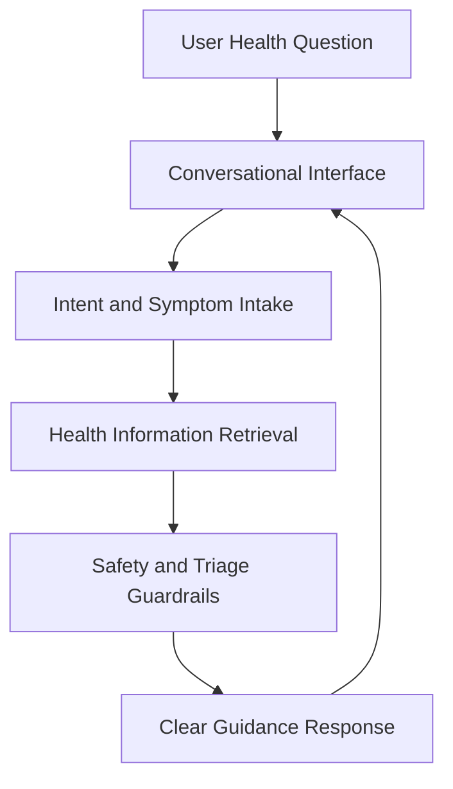

# LLM Based Health Assistant

<p align="center">

  
  
</p>

<p align="center">
  <strong>A health-assistant concept focused on conversational guidance, information retrieval, and user-friendly medical question support.</strong>
</p>

This repository is positioned as a foundation for a health-assistant workflow. The README documents a professional product direction around safe information access, clear user experience, and extensible NLP-backed assistance.

## Core Capabilities

- Frames a conversational health guidance workflow.
- Supports future integration with retrieval and triage modules.
- Documents product goals, safety considerations, and technical expansion points.
- Provides a clear structure for turning the concept into an implementation.

## Technical Architecture

The current repository is lightweight and suitable for evolving into a Python-backed assistant with retrieval, validation, and user-interface layers. The documentation defines the intended boundaries and engineering direction.

## Architecture Diagram



## Technology Stack

- Python-ready project foundation.
- NLP-oriented assistant architecture.
- Extensible design for retrieval, classification, and user interface modules.
- Safety-first framing for health information workflows.

## Repository Structure

- `README.md` - Professional project overview and implementation direction.

## Getting Started

```bash
python -m venv .venv
source .venv/bin/activate
```

```bash
# Add the application entry point as implementation modules are introduced.
```

## Professional Context

This project demonstrates product thinking around healthcare assistance, responsible information delivery, and extensible assistant architecture.
